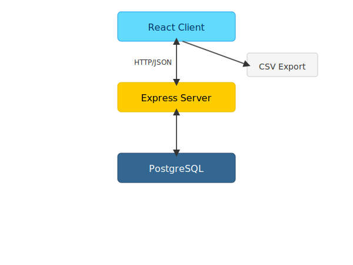

# 要件定義書（プロジェクト管理統合システム）

## 1. システム概要

### 背景
プロジェクト管理情報がExcelや別システム、口頭ベースで分散しており、  
小規模レベルのものは管理がされず、タスクの漏れ、遅延が多発。  
また、正確な進捗把握や工数集計に時間がかかっている。  

### 目的
タスク・工数・進捗を一元管理し、リアルタイムでの状況把握と業務効率化を実現する。  
Redmineなどのプロジェクト管理ツールは、チーム向けであり、  
個人、少人数向けとしては、多機能かつ、習熟に難がある。

---

## 2. システム構成

---

## 3. 業務フロー
<!-- ※業務の流れやプロセスをフロー図やステップで表現 -->

---

## 4. 業務要件

| 管理機能   | 要件概要                                                      |
|------------|---------------------------------------------------------------|
| タスク管理 | 案件・フェーズ単位でのタスク登録／一覧表示／テンプレート化／日付・工数設定 |
| 工数管理   | 作業時間の記録、案件・フェーズ・要員別の予実管理                         |
| 進捗管理   | ガントチャートによる視覚的な進捗表示と更新                             |

---

## 5. 機能要件

### 5.1 タスク管理機能
- 案件／フェーズ単位でのタスク登録・編集・削除  
- タスク一覧表示（フィルタ・ソート機能付き）  
- タスクテンプレートの作成・適用（開始日、終了日、工数、優先度、カテゴリ、担当者）  
- タスクの進捗ステータス管理（未着手／進行中／完了）  

### 5.2 工数管理機能
- 作業時間の記録（手動入力）  
- 工数の予実管理（プロジェクト別、フェーズ別、要員別、要員×フェーズ別）  
- 工数集計レポートの出力（CSV／PDF）  

### 5.3 進捗管理機能
- ガントチャート表示（タスクの期間・依存関係を可視化）  
- タスクのドラッグ＆ドロップによる日程調整  
- 進捗率の自動計算と表示  

---

## 6. 非機能要件

### システム要件
- Webアプリとして構築（モダンブラウザ対応）

### セキュリティ要件

#### 入力検証と対策
- XSS対策（入力値のサニタイズ）  
- SQLインジェクション防止（プリペアドステートメントの使用）  
- CSRFトークンによるリクエスト制御  

#### セッション管理
- セッションIDのSecure／HttpOnly設定  
- セッションタイムアウト設定  
- セッションフィクセーション対策  

#### ログ／監視
- アクセスログ／操作ログの記録と保存  
- ログのバックアップ／改ざん防止対策  

#### エラーハンドリング
- ユーザーへの具体的なエラーメッセージ非表示  
- スタックトレースの非露出  
- サーバ内でのエラーログ保存と確認体制  

---

