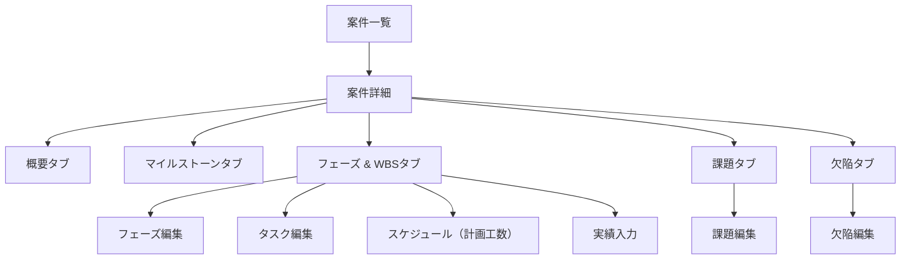
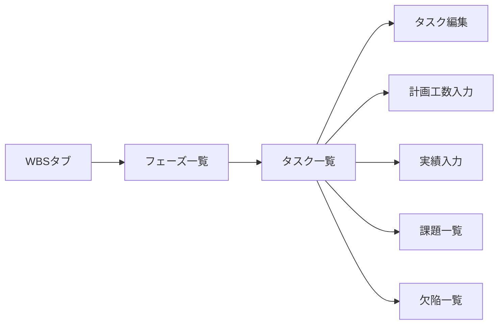
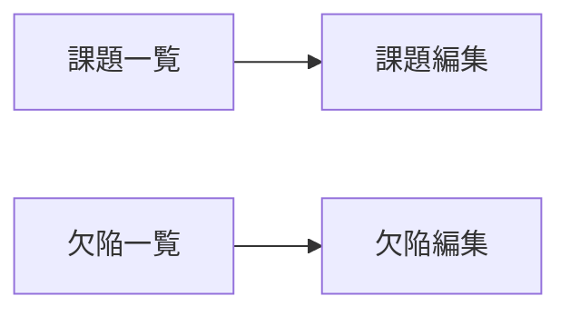

## 2. 画面遷移図（Markdown + Mermaid）

以下は **Mermaid** で書いた画面遷移図です。  
GitHub / Notion / Obsidian でそのまま表示できます。

---

### 2.1 画面遷移図（全体）

```mermaid
flowchart TD

    A[案件一覧] --> B[案件詳細]

    B --> B1[概要タブ]
    B --> B2[マイルストーンタブ]
    B --> B3[フェーズ & WBSタブ]
    B --> B4[課題タブ]
    B --> B5[欠陥タブ]

    B3 --> C[フェーズ編集]
    B3 --> D[タスク編集]
    B3 --> E[スケジュール（計画工数）]
    B3 --> F[実績入力]

    B4 --> G[課題編集]
    B5 --> H[欠陥編集]
```

---

### 2.2 詳細版（WBS周り）

```mermaid
flowchart LR

    WBS[WBSタブ] --> PhaseList[フェーズ一覧]
    PhaseList --> TaskList[タスク一覧]

    TaskList --> TaskEdit[タスク編集]
    TaskList --> PlanEdit[計画工数入力]
    TaskList --> ActualEdit[実績入力]
    TaskList --> IssueList[課題一覧]
    TaskList --> DefectList[欠陥一覧]
```

---

### 2.3 課題・欠陥周り

```mermaid
flowchart LR

    IssueList[課題一覧] --> IssueEdit[課題編集]
    DefectList[欠陥一覧] --> DefectEdit[欠陥編集]
```
